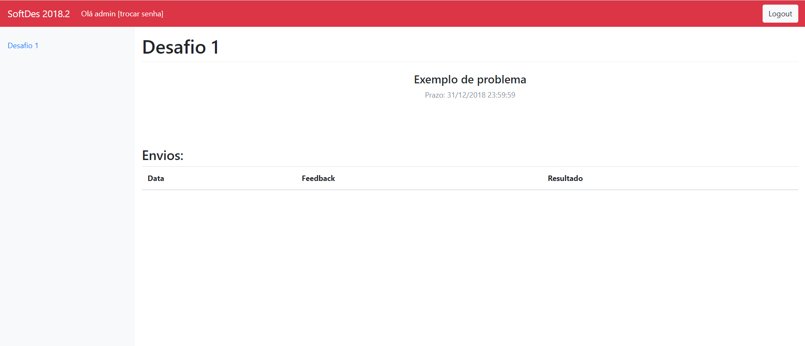

## About the Application

This application is a web-based platform designed to facilitate the student assignment submission and feedback process for a Software Design (SoftDes) course, specifically labeled as "SoftDes 2018.2." It showcases an example page for "Challenge 1," where the critical functionalities include viewing problem statements, submission deadlines, and feedback/results of submitted assignments. The application features a login functionality so that the users only login with the correct password

The application is built using Flask, a lightweight WSGI web application framework in Python. Flask is known for being simple to set up and flexible, making it ideal for small to medium-sized applications. The platform uses SQL for managing its database operations. SQL databases are robust, allowing for complex queries and transactions necessary for managing course data, assignments, user accounts, submission records, feedback, and results.
### Language:
- *Python*

### Libraries:

1. *flask*:
   - Flask
   - request
   - jsonify
   - abort
   - make_response
   - session
   - render_template
2. *flask_httpauth*: Extensão para autenticação HTTP básica.
   - HTTPBasicAuth
3. *datetime*: Módulo para manipulação de datas e horas.
   - datetime
4. *sqlite3*: Módulo para interação com bancos de dados SQLite.
   - sqlite3
5. *json*: Módulo para manipulação de dados JSON.
   - json
6. *hashlib*: Módulo para algoritmos de hash seguros.
   - hashlib

### Running in local server

1. **Requirements:**

Certifique-se de que SQLite3 está instalado no seu sistema.

- **macOS:**    
```
brew install sqlite3
```
- **Linux (Debian-based, ex.: Ubuntu):**

```
sudo apt-get install sqlite3
```
     
- **Linux (Fedora-based):**
```
sudo dnf install sqlite
```
  
- **Windows:**
Baixe o [SQLite3](https://www.sqlite.org/download.html) e adicione o binário ao seu PATH.

2. **Install the dependencies**

```
pip install flask flask-httpauth
```
or 
```
pip install -r requirements.txt
```

2. **Create the database**

```
sqlite3 quiz.db < quiz.sql
```

or 

```
python setup.py
```

3. **Create the users.csv with your credentials.**

Example:
```
admin,admin
```

4. **Add your user.**

```
python adduser.py
```

5. **Start the development server:**

```
python softdes.py
```

Now you can see in the terminal something like this:


If you open the url, you should see this screen:



### Running with Docker

Considering that you already have users.csv created with your credentials:

1. **Install Docker:**

Ensure Docker is installed on your system. Follow the instructions at [Docker Install](https://docs.docker.com/get-docker/) for your operating system.

2. **Clone the repository:**

Clone the repository containing the application code:

```sh
   git clone <repository_url>
   cd <repository_directory>
```

3. **Create the docker image:**

Build the Docker image for the application using the provided Dockerfile. Make sure to be in the root directory of the project where the Dockerfile is located.

```
docker build -t softdes-app .
```

4. **Run the Docker container:**

Start a Docker container from the built image. This will also set up the database and necessary files.

```
docker run -p 8080:8080 softdes-app
```

5. **Access the application:**

Open your web browser and go to http://localhost:8080 to access the application.
